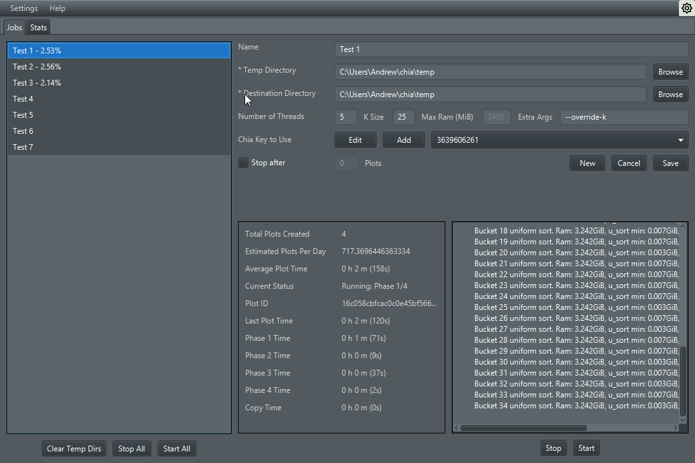
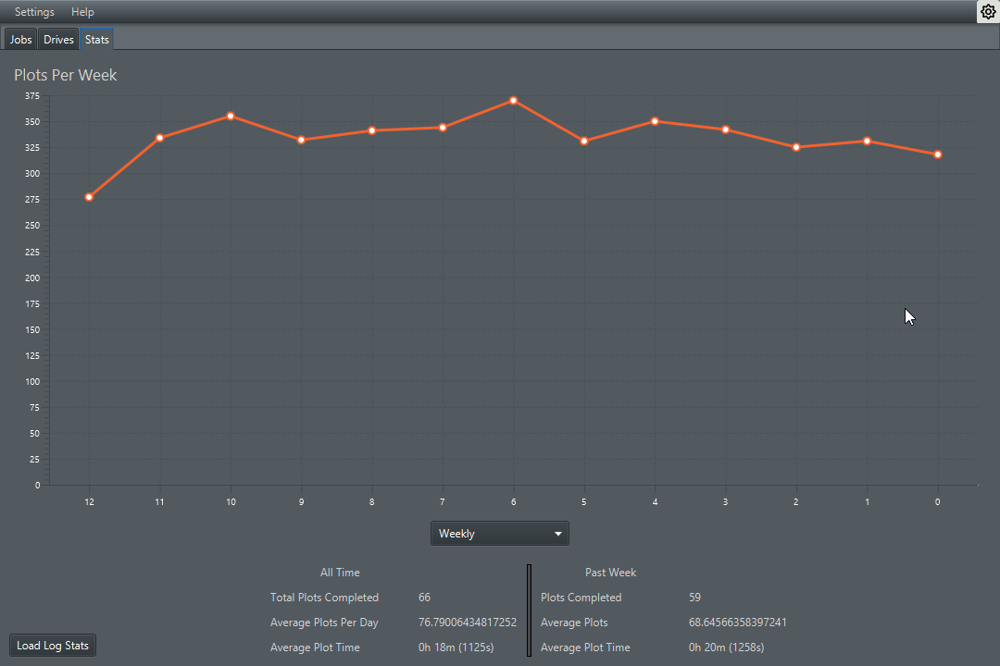

# Harry Plotter

You're a farmer, Harry!

Harry Plotter is an easy to use magical Chia plot manager for muggles! It works on Windows, MacOS, and Linux. It should
work on ARM devices as well, but you'll have to compile from source (see below) which is also very easy.

Have a question or suggestion? Join the discord https://discord.gg/Uxh5ZqJVsS

## Support

I have spent a ton of time learning for & working on Harry Plotter, so if you appreciate my work please consider sending
a tip! In addition you can post your transaction ID on a github issue (feature, bug or setup question) and I'll work
through them by order of tip amount. You can also feel free to shoot me an email. However: it is still a tip and I
cannot guarantee I will be able to solve your problem satisfactorily in a reasonable amount of time.

Chia Address: xch1ktqlc03wpetne9e0e6frz497xhhx4yx08gzn63tvjwlrlg2cg2ksf7ls24

Eth Address: 0x039c1c74e3AaCCB74457880099F441f61C9c9bAc

BTC Address: bc1qlrujsyrspf587pj2ydrz9h0k5070wfzqwq3pxf

PayPal: andrew@abueide.com

## Installation

Download the installer for your platform here: https://github.com/abueide/harry-plotter/releases

## Usage

Check out the wiki 

[Getting Started](https://github.com/abueide/harry-plotter/wiki/Getting-Started)

[Commonly Asked Questions](https://github.com/abueide/harry-plotter/wiki/Commonly-Asked-Questions)

[Optimization Guide](https://github.com/abueide/harry-plotter/wiki/Optimization-Guide)

## Compiling

### Dependencies

[JDK 16](https://adoptopenjdk.net/?variant=openjdk16&jvmVariant=hotspot)

Ubuntu/Debian users: `sudo apt install openjdk-16-jdk`

### Windows

`git clone https://github.com/abueide/harry-plotter.git`

`cd harry-plotter`

`gradlew.bat run` -- runs the application

`gradlew.bat jpackage` -- Creates an installer for your current platform which can be found in
harry-plotter/build/jpackage/

### MacOS/Linux

`git clone https://github.com/abueide/harry-plotter.git`

`cd harry-plotter`

`chmod +x gradlew`

`./gradlew run` -- runs the application

`./gradlew jpackage` -- Creates an installer for your current platform which can be found in
harry-plotter/build/jpackage/

# Roadmap

[ ] Official Pooling Protocol Support

[ ] Magical auto plot tuning algorithm

[ ] Easy to use harvester setup on multiple machines

[ ] Logs & Harvester monitoring

[x] Cool dashboard with stats

[ ] Alerts/Notifications when harvester or plotter is having problems

## Contributing

[See CONTRIBUTING.md](CONTRIBUTING.md)
